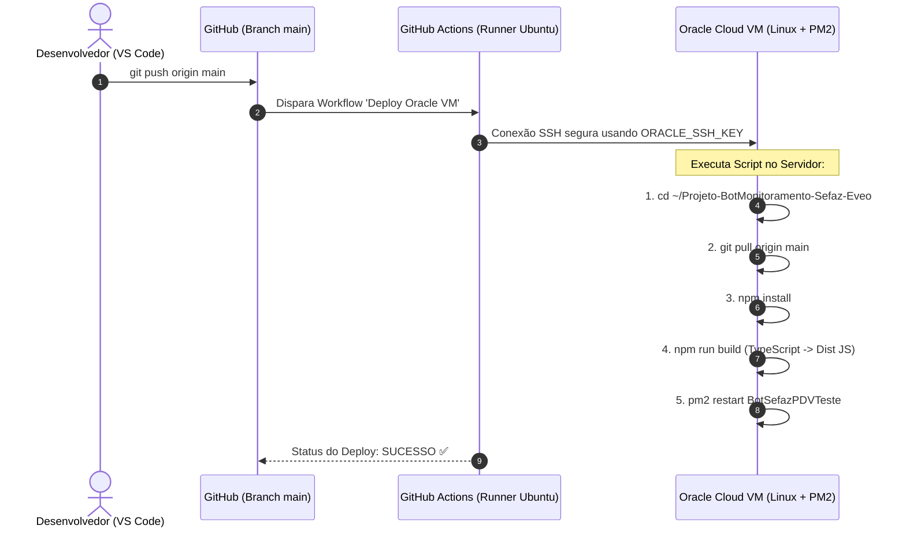

# 📝 Memoriando Técnico: Refatoração do Bot & Esteira CI/CD (Oracle Cloud + GitHub Actions)

---

## 📌 O que eu fiz no Projeto (Refatoração do Código)

Deixei a arquitetura do bot **100% profissional, resiliente e escalável em TypeScript**, focando em código limpo e eliminação de alarmes falsos.

### 1. Sistema de Tripla Verificação & Consenso Ponderado (SEFAZ)
Ajustei o monitoramento da SEFAZ para consultar 3 fontes em paralelo a cada 60 segundos, aplicando um sistema de votos ponderados:
* **Ping Direto SOAP mTLS (Peso 4.0):** Testa os servidores SOAP estaduais usando o meu Certificado Digital A1. É a fonte de verdade soberana.
* **Fazenda Nacional (Peso 2.0):** Scraping do portal oficial do governo.
* **Webmania API (Peso 1.0):** API JSON de confirmação cruzada.
> **Por que fiz isso?** Como o Ping Direto (4.0) pesa mais que as outras duas juntas (3.0), se sites de terceiros oscilarem mas o SOAP direto estiver saudável, o bot permanece em estado **ONLINE** e não gera alarmes falsos.

### 2. Filtro Anti-Flapping (Debounce) & Fim do Spam no Discord
* **Para confirmar queda/instabilidade:** Exige **3 verificações consecutivas com falha** (3 minutos) antes de notificar no Discord. Oscilações momentâneas de 1 minuto são filtradas.
* **Para confirmar recuperação:** Exige **2 verificações consecutivas OK** para garantir que o serviço realmente estabilizou antes de enviar o card de *Serviço Recuperado*.
* **Sem spam:** Quando o serviço cai, o bot notifica **uma única vez**. Enquanto estiver caindo/oscilando, ele apenas atualiza o banco local sem ficar marcando a equipe repetidamente.

### 3. Modo Silencioso & Histórico em SQLite
* **Modo Silencioso (22:00 às 08:00):** O bot continua monitorando 24h e gravando no SQLite (`incident_log`), mas **não emite menções sonoras** durante a madrugada.
* **Relatório Matinal (09:00):** Envia um compilado com o início, término e duração exata de cada queda que ocorreu durante a noite.
* **Banco SQLite local:** Tabela `monitor_status` (mantém o estado para recuperação pós-reboot) e `incident_log` (histórico de auditoria).

### 4. Alerta do Certificado Digital A1
* Criei o `CertificateWatcher.ts` que lê nativamente a validade do arquivo `.pfx`.
* Todo dia às 10:00 ele checa: se faltar **≤ 30 dias** avisa no canal; se faltar **≤ 15 dias** faz alerta urgente com menção; se expirar avisa crítico. (O certificado atual expira em 25/05/2027).

### 5. Arquitetura de Comandos (Command Handler Pattern)
Organizei os comandos em `src/commands/`, reduzindo o `bot.ts` de 338 linhas para um arquivo enxuto:
* `!status` → Status em tempo real + latência/ping do bot.
* `!relatorio` → Status atual + relatório de incidentes das últimas 24h.
* `!certificado` → Informações do Certificado Digital A1.
* `!dbstatus` → Dados técnicos brutos salvos no banco SQLite.

### 6. Menções Dinâmicas por Cargo
* Configurei o `notifier.ts` com a função `buildMention()`.
* Já deixei o código preparado para ler `ROLE_SUPORTE`, `ROLE_RELACIONAMENTO`, `ROLE_IMPLANTACAO` e `ROLE_MARKETING` do `.env`. Enquanto os IDs não forem preenchidos no `.env`, ele faz o fallback automático para `@everyone`.

---

## 🔒 O que fiz no Git & Repositório

1. **Inicialização e Sincronização:** Inicializei o repositório Git local e sincronizei com o meu GitHub: `https://github.com/Lucas-Coelho-Dev/Projeto-BotMonitoramento-Sefaz-Eveo.git`.
2. **Segurança de Dados Sensíveis (`.gitignore`):**
   * Bloqueei o envio do arquivo `.env` (contém tokens e senhas).
   * Bloqueei o envio do `certificado.pfx` (chave privada do certificado).
   * Bloqueei arquivos `.db`, `node_modules/`, `dist/` e pastas rascunho (`scratch/`, `sete-a-zero-copa/`).
3. **Template de Configuração:** Criei o `.env.example` para documentar todas as variáveis que precisam ser preenchidas no servidor.

---

## 🚀 Como Funciona o CI/CD (Deploy Automático na Oracle Cloud)

Montei uma esteira de **Integração e Entrega Contínua (CI/CD)** via **GitHub Actions** (`.github/workflows/deploy.yml`).

### Como a Esteira Funciona (Fluxo Completo):



### O Script do Workflow (`deploy.yml`):
```yaml
name: Deploy Oracle VM

on:
  push:
    branches:
      - main

jobs:
  deploy:
    runs-on: ubuntu-latest

    steps:
      - name: Deploy na Oracle
        uses: appleboy/ssh-action@v1.2.2
        with:
          host: ${{ secrets.ORACLE_HOST }}
          username: ${{ secrets.ORACLE_USER }}
          key: ${{ secrets.ORACLE_SSH_KEY }}
          script: |
            cd ~/Projeto-BotMonitoramento-Sefaz-Eveo
            echo "Atualizando repositório..."
            git pull origin main
            echo "Instalando dependências..."
            npm install
            echo "Compilando..."
            npm run build
            echo "Reiniciando PM2..."
            pm2 restart BotSefazPDVTeste
            echo "Deploy concluído!"
```

### O que precisei configurar no GitHub Secrets:
Para a esteira rodar sem expor senhas, cadastrei 3 segredos em **GitHub ➔ Settings ➔ Secrets and variables ➔ Actions**:
1. `ORACLE_HOST` → IP público da VM Oracle.
2. `ORACLE_USER` → Usuário SSH (`ubuntu` ou `opc`).
3. `ORACLE_SSH_KEY` → Chave privada SSH de acesso ao servidor.

---

### 💡 Resumo Prático para o meu dia a dia:
A partir de agora, **eu não preciso mais acessar a máquina da Oracle manualmente por SSH** para atualizar o bot. 

Toda vez que eu fizer qualquer alteração no código pelo VS Code e rodar:
```bash
git add .
git commit -m "Minha alteração"
git push
```
O GitHub Actions assume a tarefa, conecta na Oracle, baixa o código novo, compila e reinicia o processo `BotSefazPDVTeste` no **PM2** automaticamente em segundos!
