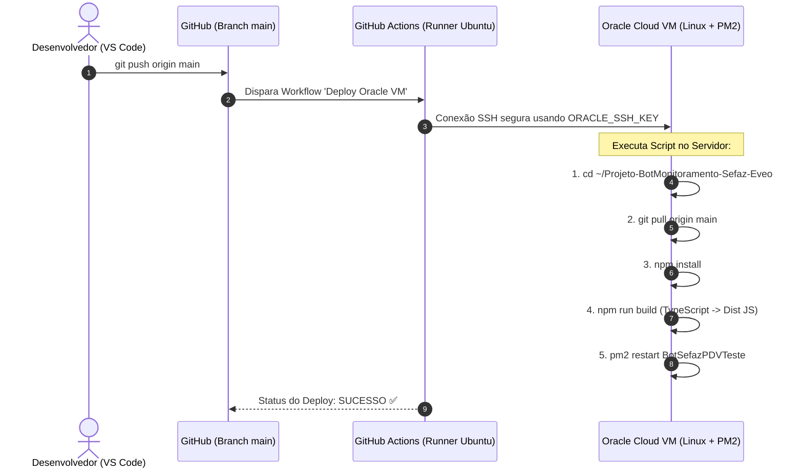

# 📝 Memorando Técnico: Refatoração do Bot & Esteira CI/CD (Oracle Cloud + GitHub Actions)

---

## 📌 O que eu fiz no Projeto (Refatoração do Código & Racional de Decisões)

Deixei a arquitetura do bot **100% profissional, resiliente e escalável em TypeScript**, focando em código limpo, eliminação de alarmes falsos e facilidade de manutenção.

---

### 1. Sistema de Tripla Verificação & Consenso Ponderado (SEFAZ)
Ajustei o monitoramento da SEFAZ para consultar 3 fontes em paralelo a cada 60 segundos, aplicando um sistema de votos ponderados:
* **Ping Direto SOAP mTLS (Peso 4.0):** Testa os servidores SOAP estaduais usando o meu Certificado Digital A1. É a fonte de verdade soberana.
* **Fazenda Nacional (Peso 2.0):** Scraping do portal oficial do governo.
* **Webmania API (Peso 1.0):** API JSON de confirmação cruzada.

> 💡 **Por que fiz isso?**  
> Como o Ping Direto (4.0) pesa mais que as outras duas fontes juntas (3.0), se sites de terceiros oscilarem mas o SOAP direto via certificado estiver saudável, o bot permanece em estado **ONLINE** e não gera alarmes falsos. Isso garante que a palavra final é sempre da conexão técnica real do nosso emissor com a SEFAZ.

---

### 2. Filtro Anti-Flapping (Debounce) & Fim do Spam no Discord
* **Para confirmar queda/instabilidade (`ONLINE` → `OFFLINE`/`INSTÁVEL`):** Exige **3 verificações consecutivas com falha** (3 minutos mantidos) antes de notificar no Discord.
* **Para confirmar recuperação (`OFFLINE`/`INSTÁVEL` → `ONLINE`):** Exige **2 verificações consecutivas OK** (2 minutos mantidos) antes de declarar o *Serviço Recuperado*.

> 💡 **Por que fiz isso?**  
> Em redes instáveis ou momentos de pico, a SEFAZ pode oscilar em um único check isolado. Exigir 3 checks falhos evita alarmar a equipe por um solavanco de 1 minuto que se resolve sozinho. Exigir 2 checks OK para declarar recuperação evita o efeito "yo-yo" (recupera e cai em seguida), eliminando totalmente os alertas duplicados no Discord.

---

### 3. Modo Silencioso & Histórico em SQLite
* **Modo Silencioso (22:00 às 08:00):** O bot continua monitorando 24h e gravando no SQLite (`incident_log`), mas **não emite menções sonoras** durante a madrugada.
* **Relatório Matinal (09:00):** Envia um compilado com o início, término e duração exata de cada queda que ocorreu durante a noite.

> 💡 **Por que fiz isso?**  
> Fora do horário comercial não há operadores nos caixas para atuar de imediato. Ficar enviando menções sonoras na madrugada gera fadiga de alertas (*alert fatigue*), fazendo a equipe ignorar o canal. O bot grava tudo em background no SQLite e entrega o relatório completo às 09:00, pronto para a tomada de decisão da gestão.

---

### 4. Alerta Inteligente do Certificado Digital A1
* Criei o `CertificateWatcher.ts` que lê nativamente a data de expiração (`NotAfter`) do arquivo `.pfx` usando `tls.createSecureContext`.
* Todo dia às 10:00 ele inspeciona o certificado:
  * **≤ 30 dias:** Alerta amarelo informativo.
  * **≤ 15 dias:** Alerta urgente em vermelho com menção à equipe.
  * **Expirado:** Alerta crítico imediato. *(O certificado atual expira em 25/05/2027)*.

> 💡 **Por que fiz isso?**  
> Certificados digitais A1 têm validade de 1 ano e expiram sem aviso prévio das certificadoras. Quando o certificado expira, todas as emissões de notas e pings SOAP falham silenciosamente. Inspecionar a chave nativamente garante 30 dias de aviso prévio para a renovação administrativa, evitando a parada total das vendas.

---

### 5. Arquitetura de Comandos (Command Handler Pattern)
Organizei os comandos em arquivos dedicados dentro da pasta `src/commands/`, utilizando um mapa de comandos (`Map<string, Command>`):
* `!status` → Status em tempo real de todas as pontas + latência (ping) do bot.
* `!relatorio` → Status atual + lista formatada de incidentes das últimas 24 horas.
* `!certificado` → Validade, titular, emissor e dias restantes do Certificado Digital.
* `!dbstatus` → Tabela com os dados brutos gravados no SQLite (debug técnico).

> 💡 **Por que fiz isso?**  
> O `bot.ts` antigo era monolítico, com 338 linhas cheias de `if/else` misturando regras de negócio, cron jobs e banco. Separar cada comando em seu próprio módulo reduz o `bot.ts` para ~120 linhas limpas, facilita testes unitários e permite que qualquer desenvolvedor adicione novos comandos no futuro sem risco de quebrar o bot.

---

### 6. Menções Dinâmicas por Cargo (Role-Based Mentions)
* Configurei a função `buildMention()` no `notifier.ts`.
* O bot agora lê `ROLE_SUPORTE`, `ROLE_RELACIONAMENTO`, `ROLE_IMPLANTACAO` e `ROLE_MARKETING` do arquivo `.env`.
* Enquanto os IDs de cargo não forem preenchidos no `.env`, ele faz o fallback seguro para `@everyone`.

> 💡 **Por que fiz isso?**  
> Mensionar `@everyone` em toda oscilação assusta toda a empresa (incluindo setores comerciais e diretoria). Notificar por cargos específicos permite que apenas o Suporte e a Implantação recebam o aviso de atuação técnica de imediato, mantendo a comunicação limpa e direcionada.

---

### 7. Banco de Dados SQLite Nativo (`better-sqlite3`)
* O sistema salva o estado em tempo real na tabela `monitor_status` e auditoria histórica em `incident_log`.

> 💡 **Por que fiz isso?**  
> Elimina totalmente a necessidade de instalar e manter um servidor de banco externo (como PostgreSQL ou MySQL) na VM da Oracle. O SQLite é 100% auto-contido em um único arquivo local (`monitor_status.db`), consome menos de 20MB de memória RAM, suporta milhares de gravações sem gargalo e não corre o risco de cair por falha de conexão de rede.

---

## 🔒 O que fiz no Git & Repositório

1. **Inicialização e Sincronização:** Inicializei o repositório Git local e sincronizei com o meu GitHub: `https://github.com/Lucas-Coelho-Dev/Projeto-BotMonitoramento-Sefaz-Eveo.git`.
2. **Segurança de Dados Sensíveis (`.gitignore`):**
   * Bloqueei o envio do arquivo `.env` (tokens e senhas do bot).
   * Bloqueei o envio do `certificado.pfx` (chave privada da empresa).
   * Bloqueei arquivos `.db`, `node_modules/`, `dist/` e pastas de rascunhos (`scratch/`, `sete-a-zero-copa/`).
3. **Template de Ambiente:** Criei o arquivo `.env.example` documentando todas as variáveis necessárias para a implantação.

> 💡 **Por que fiz isso?**  
> Subir certificados digitais A1 ou senhas para repositórios do GitHub (mesmo privados) é uma falha grave de segurança. O `.gitignore` garante que dados sensíveis nunca saiam do meu ambiente local, forçando o servidor da nuvem a ter seu próprio arquivo `.env` seguro.

---

## 🚀 Como Funciona o CI/CD (Deploy Automático na Oracle Cloud)

Montei uma esteira de **Integração e Entrega Contínua (CI/CD)** via **GitHub Actions** (`.github/workflows/deploy.yml`).

### Fluxo da Esteira de Deploy:



### O Script do Workflow (`deploy.yml`):
```yaml
name: Deploy Oracle VM

on:
  push:
    branches:
      - main

jobs:
  deploy:
    runs-on: ubuntu-latest

    steps:
      - name: Deploy na Oracle
        uses: appleboy/ssh-action@v1.2.2
        with:
          host: ${{ secrets.ORACLE_HOST }}
          username: ${{ secrets.ORACLE_USER }}
          key: ${{ secrets.ORACLE_SSH_KEY }}
          script: |
            cd ~/Projeto-BotMonitoramento-Sefaz-Eveo
            echo "Atualizando repositório..."
            git pull origin main
            echo "Instalando dependências..."
            npm install
            echo "Compilando..."
            npm run build
            echo "Reiniciando PM2..."
            pm2 restart BotSefazPDVTeste
            echo "Deploy concluído!"
```

### Segredos Cadastrados no GitHub (Secrets):
1. `ORACLE_HOST` → IP público da VM na Oracle Cloud.
2. `ORACLE_USER` → Usuário SSH do sistema Linux (`ubuntu` / `opc`).
3. `ORACLE_SSH_KEY` → Chave privada SSH de acesso ao servidor.

> 💡 **Por que fiz isso?**  
> Fazer deploy manual via FileZilla ou digitando comandos SSH abre espaço para erros humanos (esquecer de compilar o TypeScript, esquecer de instalar pacotes novos ou deixar a aplicação cair sem o gerenciador PM2). Com o CI/CD via GitHub Actions, todo `git push` atualiza, compila e reinicia a aplicação na Oracle Cloud de forma 100% automatizada, padronizada e auditável.
